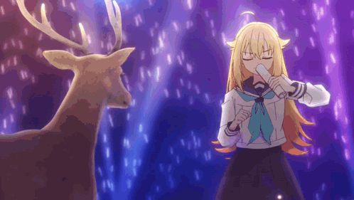

# 🦌 Deer Club

## Welcome to the Deer Club!

Inspired by the enchanting world of "Shikanoko no Kōtan" (鹿の子の物語), the Deer Club is a haven for developers and anime enthusiasts alike. Our mission is to blend the magic of coding with the beauty of anime, creating a community where creativity and technology thrive.

### What We Do

- **Open Source Projects**: We develop and maintain a variety of open source projects, ranging from web applications to software libraries.
- **Anime & Coding**: We integrate themes and inspirations from our favorite anime into our coding projects, creating unique and enjoyable experiences.
- **Community Collaboration**: We believe in the power of collaboration and welcome contributions from developers of all levels.

### Our Projects

- **Project 1**: Brief description of the project.
- **Project 2**: Brief description of the project.
- **Project 3**: Brief description of the project.

### Join Us

We are always looking for passionate developers and anime fans to join our community. Whether you're a seasoned coder or just starting out, there's a place for you in the Deer Club.

- **Contribute**: Check out our [contributing guidelines](https://link-to-contributing-guidelines).
- **Connect**: Join our discussions on [Discord](https://discord.gg/YpWDPcKC) 

### Get in Touch

If you have any questions or just want to say hi, feel free to reach out to us at [contact@deerclub.org](mailto:tranquangsang12.7@gmail.com).

 
